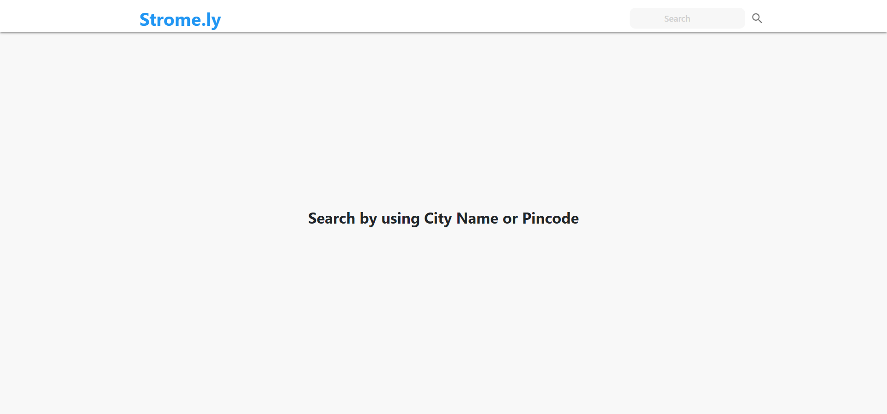
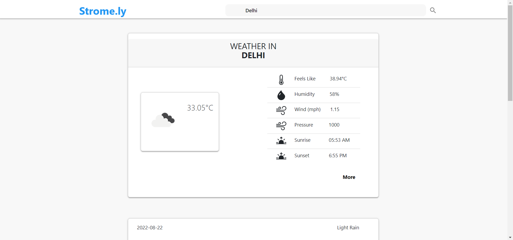
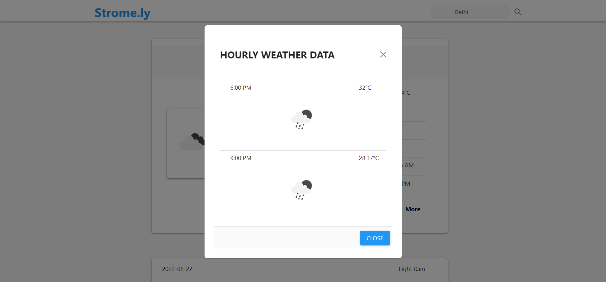
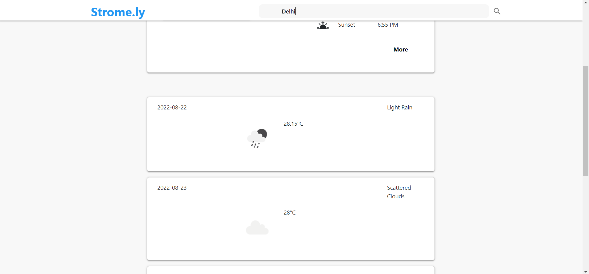
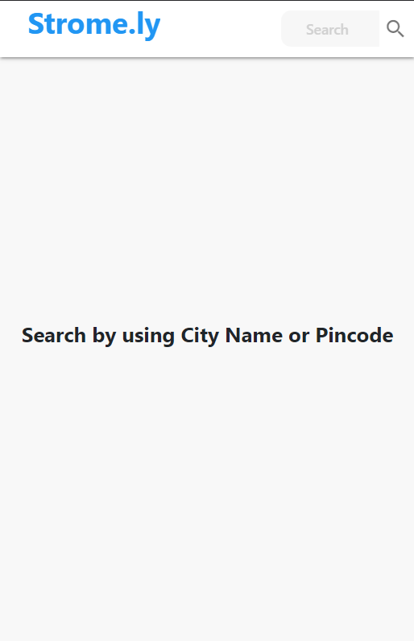
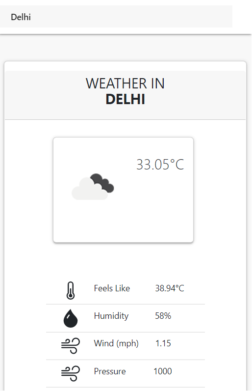
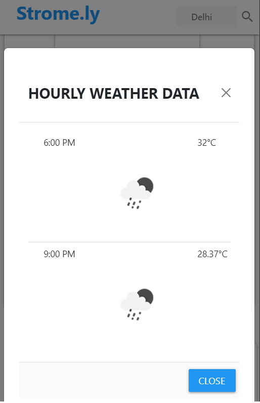
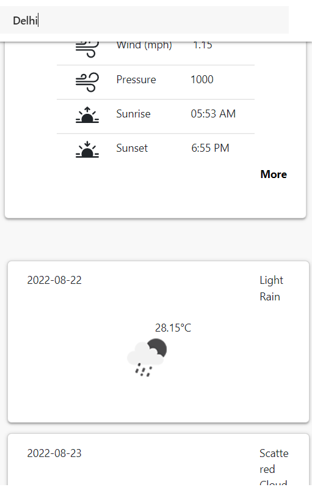
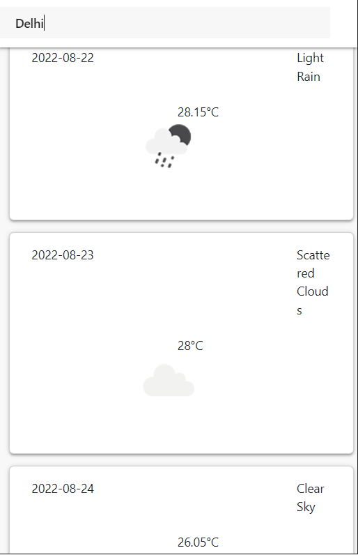

<!-- 
Strome.ly
 -->

# Strome.ly:
<strong>Strome.ly</strong> provides global weather data via OpenWeatherMap API, including current weather data, forecasts, and nowcasts weather data for any geographical location. The Strome.ly provides a hour-by-hour hyperlocal precipitation forecast for any location.

-----
## Table of Contents:

* [Features](#item1)
* [Strome.ly Overview](#item2)
* [Installation Guide](#item3)
* [Screenshots](#item4)

-----

## Features:

* Welcome Page
* Search Bar
* Current Weather data
* Forecasts Weather Data
* Nowcasts Weather Data
* Hour-by-Hour Weather Data
* Sunrise and Sunset Time

* Front-end
  * Html, Css, Javascript & Bootstrap
* Backe-end
  * Javascript, Bootstrap & OpenWeatherMap API

-----

## Forum Overview:
First of all in `Strome.ly’s` home page we have a navbar & a search bar - where `users can search for weather information`. User can search for weather information `by using pincode or city name`. The `Strome.ly provides` weather data via API, including `current weather data`, `forecasts`, `nowcasts weather data` & also `hour-by-hour  weather data`.

-----

## Installation Guide:

* [Step 1: Download the Repository](#step1)
* [Step 2: Run Strome.ly](#step2)

-----

### Step 1: Download the Repository

Either Clone the repository using git clone: `git clone https://github.com/biswajittt/Strome.ly`
or install via <a target="_blank" href="https://github.com/biswajittt/Strome.ly/archive/refs/heads/main.zip">zip</a> and extract 
to any of your folders you wish.

-----

### Step 2: Run Strome.ly:

To run the Strome.ly application, you can double click on the `stromely.html` file.

-----

## Screenshots:
### Strome.ly in Computer:

### Strome.ly in Mobile:

